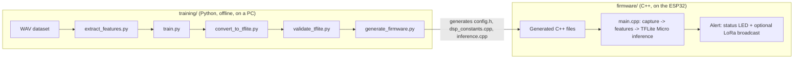

# IA_ESP_CHAINSAW

Embedded, low-power acoustic chainsaw detector for anti-poaching / illegal-logging monitoring in remote forest environments (built and validated against Colombian rainforest field conditions).

An ESP32 node continuously listens to its surroundings through an I2S microphone, extracts the same audio features used to train a small neural network (MFCC + spectral features), runs the network fully on-device with TensorFlow Lite Micro, and raises an alert (status LED + optional LoRa radio broadcast) whenever a chainsaw is detected — without any internet or GPS infrastructure.

The project has two independent, decoupled "modules":

- **[`training/`](training/README.md)** — a Python pipeline that builds the dataset, trains/evaluates the Keras model, converts it to TensorFlow Lite, validates the conversion, and generates the C++ files consumed by the firmware.
- **[`firmware/`](firmware/README.md)** — the C++ (Arduino framework / PlatformIO) ESP32 application that runs the generated model in real time and reacts to detections.

See each module's own README for a detailed description of its internal architecture:

- [training/README.md](training/README.md)
- [firmware/README.md](firmware/README.md)

## How the two modules fit together



`generate_firmware.py` is the bridge between the two modules: it takes the trained model and the feature configuration used during training and turns them into plain C++/header files that are checked into `firmware/`, so the firmware never needs Python, TensorFlow, or any training-time dependency to run.

## HARDWARE REQUIREMENTS (IOT)

### BREADBOARD

> Note : The breadboard is used for prototyping and testing the circuit before finalizing the design.
>> Anyone model of breadboard can be used, but a standard size breadboard is recommended for ease of use and compatibility with other components.

### ESP32 (Microcontroller)

> Name: ESP32-WROOM-32 Development Board

> If the board isn't recognized when plugged in (no COM/serial port shows up, `pio run --target upload` / `inv upload` fails to find the device), install the [Silicon Labs CP210x USB-to-UART VCP driver](https://www.silabs.com/software-and-tools/usb-to-uart-bridge-vcp-drivers?tab=downloads). This is only needed for boards using the **Silicon Labs CP210x** USB-to-UART chip; not every ESP32 dev board uses it.

### Microphone

> Name: INMP441 Omnidirectional Microphone (I2S digital output interface)

### LoRa Module (Optional/Context Dependent)

> Precizion: For transmitting alerts across the forest environment without GPS infrastructure.

## PYTHON INSTALLATION PATHWAY

Install `Python 3.11.X` and add it to your PATH environment variable.
Afterwards, run the following script `init` to create a virtual environment and install the dependencies.

### Windows

Follow this link to install [Python 3.11](https://www.python.org/downloads/release/python-3110/).

#### PowerShell

```powershell
# Example for Windows PowerShell
$env:PATH = "C:\Python311;" + $env:PATH
./init.ps1
```

#### Command Prompt

```bat
:: Example for Windows Command Prompt
set PATH=C:\Python311;%PATH%
.\init.bat
```

#### WSL / Git Bash

```bash
export PATH="/usr/bin/python3.11:$PATH"
./init.sh
```

### Linux

```bash
# Example for Linux
export PATH="/usr/bin/python3.11:$PATH"
./init.sh
```

## Dependencies Management

If you are adding a library to the `requirements.in` file (base requirements), you have to run the `invoke dependencies` command to update the `requirements.txt` file using **pip-tools**.

Please install on your system the `make` command, which is required to run specific tasks linked to the C++ compilation and the ESP32 firmware build process. You can install it using your package manager (e.g., `apt`, `yum`, `brew`, etc.) depending on your operating system.

## VSCODE 

### Extensions

Install the recommended extensions for VSCODE, notably `PlatformIO IDE`, which is required to build and upload the firmware to the ESP32.
Besides, you can install the following extensions to improve your experience:
- `Python` by Microsoft
- `Pylance` by Microsoft
- `C/C++` by Microsoft
- `C/C++ Advanced Lint` by Jean Pierre Boudra
- `CMake Tools` by Microsoft
- `CMake` by twxs
- `CMake Language Support` by vector-of-bool
- `CMake Tools Helper` by vector-of-bool
- `CMake Tools Extension Pack` by vector-of-bool

### Workspace

Open the workspace file `IA_ESP_CHAINSAW.code-workspace` to have a better experience (File > Open Workspace from File).

## VENV

Afterwards, you can activate the virtual environment and run the main script.

### Windows

#### PowerShell

```powershell
.\venv\Scripts\Activate.ps1
```

#### Command Prompt

```bat
.\venv\Scripts\Activate.bat
```

#### WSL / Git Bash

```bash
source venv/Scripts/activate
```

### Linux

```bash
source venv/bin/activate
```

## Usage: running tasks with Invoke

All actions on this project (training, conversion, validation, firmware generation, firmware build/flash/monitor, dependency management) are exposed as [Invoke](http://www.pyinvoke.org/) tasks defined in [tasks.py](tasks.py). With the virtual environment activated, list every available task and its alias with:

```powershell
inv --list
```

### Training pipeline (Python)

| Task | Alias(es) | Description |
| --- | --- | --- |
| `inv extract-features` | `extract`, `e`, `ef` | Extract audio features from `training/data/raw` into `training/data/processed/feature_dataset.npz`. |
| `inv train` | `t` | Check/refresh the feature cache, then train the Keras model (`training/train.py`). |
| `inv convert` | `c`, `tflite`, `tfl` | Convert the trained Keras model to a `.tflite` file. |
| `inv validate-tflite` | `vt`, `v-tflite`, ... | Compare the Keras model against the TFLite model at several thresholds and save a validation report. |
| `inv labels` | `check_labels`, `cl` | Check the dataset manifest for potential mislabelling. |
| `inv generate-firmware` | `firmware`, `gf` | Regenerate the firmware's C++ config/model files from the trained model. |
| `inv full-pipeline` | `fp`, `pl`, `pipeline` | Run the entire pipeline in order: extract → train → convert → validate → generate firmware. |
| `inv plot-latest` | `plt`, `graph_latest`, `gl` | Plot the learning curves of the most recent training report. |
| `inv plot-history` | `ph`, `graph_history`, `gh` | Plot the evolution of test/validation metrics across all training reports. |

### Firmware (ESP32 / PlatformIO)

| Task | Alias(es) | Description |
| --- | --- | --- |
| `inv build` | `b` | Compile the firmware with PlatformIO. |
| `inv upload` | `up`, `u`, `flash`, `f`, `run` | Flash the compiled firmware to a connected ESP32. |
| `inv monitor` | `m` | Open the PlatformIO serial monitor. |
| `inv write-monitor` | `wm`, `save_monitor`, `sm` | Open the serial monitor and also save its output to `output.txt`. |
| `inv prune` | `p`, `clean` | Clean up PlatformIO system files/cache. |

### Dependency management

| Task | Alias(es) | Description |
| --- | --- | --- |
| `inv dependencies` | `d`, `deps` | Recompile `requirements.txt` from `requirements.in` with pip-tools. |
| `inv sync-dependencies` | `s`, `sync_deps`, `sync`, `sd` | Recompile then sync the venv with `requirements.txt`. |
| `inv install` | `i`, `r`, `reset`, `reinstall` | Reinstall/upgrade every dependency from `requirements.txt`. |

A typical end-to-end workflow, from a fresh dataset to a flashed board, is:

```powershell
& '.\venv\Scripts\Activate.ps1'
inv full-pipeline   # extract features, train, convert, validate, generate firmware C++ files and build         # compile the firmware with the freshly generated model
inv upload           # flash the ESP32
inv monitor          # watch live detections over serial
```

For the detailed internals of each module, see [training/README.md](training/README.md) and [firmware/README.md](firmware/README.md).

