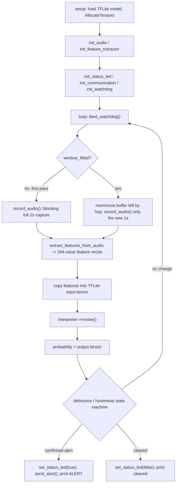

# `firmware/` — ESP32 application

PlatformIO / Arduino-framework C++ firmware that runs the chainsaw classifier fully on-device on an ESP32, from raw microphone samples to an alert, with no network or GPS dependency. Built against the model and constants generated by [`training/generate_firmware.py`](../training/generate_firmware.py) — see [training/README.md](../training/README.md) for how those files are produced.

## Board & toolchain

- **Board**: `nodemcu-32s` (ESP32-WROOM-32), `platform = espressif32`, `framework = arduino`, C++17 (`platformio.ini`).
- **Libraries** (`lib_deps` in [`platformio.ini`](platformio.ini)):
  - `tanakamasayuki/TensorFlowLite_ESP32` — TensorFlow Lite Micro runtime for on-device inference.
  - `jgromes/RadioLib` — LoRa radio (SX1276) for long-range alert broadcast.
  - `kosme/arduinoFFT` — FFT used to compute the mel spectrogram/MFCCs on-device.
- `build_src_filter = +<*> -<templates/>` excludes `src/templates/` (see below) from the build.

Build/flash/monitor through the root project's Invoke tasks (`inv build`, `inv upload`, `inv monitor` — see the root [README.md](../README.md#usage-running-tasks-with-invoke)), which wrap `platformio run` from this directory.

## Runtime flow (`src/main.cpp`)



1. **`setup()`** loads the embedded TFLite model (`g_model_data`), builds a `tflite::MicroInterpreter` over a `6 KiB` `tensor_arena`, and calls `AllocateTensors()`. It then initializes the I2S microphone, the DSP feature extractor, the status LED, the LoRa radio, and the task watchdog — the status LED and LoRa initializations are no-ops when their respective flag in `app/flags.h` is `0`.
2. **`loop()`** feeds the watchdog, captures audio into a **sliding window**: the first pass blocks for a full `AUDIO_WINDOW_SAMPLES` (2s) window; every subsequent pass shifts the buffer left by `kHopSamples` (1s) and only blocks to read the newest second, so inference runs roughly every second instead of every two seconds (halving worst-case detection latency).
3. The 16000-sample `int16_t` window is turned into a 194-value `float` feature vector (`extract_features_from_audio`, see below), copied into the input tensor, and run through `interpreter->Invoke()`.
4. The output probability goes through a **debounce/hysteresis** state machine (`kDetectionEnterThreshold`/`kDetectionExitThreshold`/`kDetectionConsecutiveFrames` in `board_config.h`) before being turned into an alert, to avoid single-frame false positives and verdict flicker: `kDetectionConsecutiveFrames` consecutive windows above `kDetectionEnterThreshold` (0.65) raise the alert; the probability must drop below `kDetectionExitThreshold` (0.35) to clear it.
5. On a confirmed alert: the status LED turns on and an alert is broadcast over LoRa (if enabled). On clearing: the LED turns off.

`ENABLE_DEBUG_LOGS` (in `app/flags.h`, `0` by default) gates all verbose `Serial` debug output (raw tensor dumps, feature vector preview, model tensor types) so production builds stay quiet and fast.

## Directory layout

```
firmware/
├── platformio.ini
├── GLOBAL_ARCHI.MD          # historical notes on a past memory-optimization refactor (tensor_arena, MFCC buffers)
├── IMPROVEMENTS.MD          # running notes on known issues / planned improvements
├── include/
│   ├── app/
│   │   ├── config.h          # GENERATED (generate_feature_config.py) — AUDIO_CONFIG (sample rate, window/hop, MFCC params)
│   │   ├── board_config.h    # HAND-MAINTAINED — pins, thresholds, watchdog timeout, LoRa config (survives regeneration)
│   │   ├── flags.h           # HAND-MAINTAINED — ENABLE_DEBUG_LOGS / ENABLE_STATUS_LED / ENABLE_LORA_COMMUNICATION
│   │   └── dsp_constants.h   # GENERATED — declares MEL_MATRIX / DCT_MATRIX (defined in src/app/dsp_constants.cpp)
│   ├── drivers/
│   │   ├── audio.h            # I2S microphone driver (INMP441)
│   │   ├── gpio.h              # status LED
│   │   └── sensor.h            # empty — no additional sensor implemented yet
│   ├── model/
│   │   └── inference.h         # declares g_model_data[] / g_model_data_len (defined in src/model/inference.cpp, GENERATED)
│   ├── services/
│   │   ├── mfcc.h              # public feature-extraction API
│   │   ├── mfcc_config.h        # AUDIO_WINDOW_SAMPLES / FEATURE_FRAME_COUNT / FEATURE_VECTOR_SIZE / DETECTION_THRESHOLD
│   │   ├── mfcc_utils.h         # internal DSP helpers (not meant to be used outside services/mfcc.cpp)
│   │   ├── watchdog.h           # ESP32 task watchdog wrapper
│   │   └── communication.h      # LoRa (RadioLib) alert broadcast
│   └── utils/
│       └── debug.h              # Serial debug helpers, gated by ENABLE_DEBUG_LOGS
└── src/
    ├── main.cpp                 # orchestrator: setup()/loop() described above
    ├── app/
    │   └── dsp_constants.cpp     # GENERATED — MEL_MATRIX / DCT_MATRIX float arrays
    ├── drivers/
    │   ├── audio.cpp              # I2S init + record_audio()
    │   └── gpio.cpp                # init_status_led() / set_status_led()
    ├── model/
    │   └── inference.cpp           # GENERATED — g_model_data[] (embedded .tflite bytes) + SHA-256/size header comment
    ├── services/
    │   ├── mfcc.cpp                 # extract_features_from_audio() / init_feature_extractor() / is_chainsaw_detected()
    │   ├── mfcc_utils.cpp           # delta coefficients, Hann window, signal reflection, small matrix inversion
    │   ├── watchdog.cpp             # init_watchdog() / feed_watchdog() (esp_task_wdt)
    │   └── communication.cpp        # init_communication() / send_alert() (RadioLib SX1276)
    ├── utils/
    │   └── debug.cpp                 # Serial debug helpers implementation
    └── templates/
        └── record.cpp                # legacy/reference 32-bit I2S capture + median filter, excluded from the build
```

### Generated vs. hand-maintained files

Three files are regenerated by `training/generate_firmware.py` every time the model or feature config changes, and **must not be hand-edited** (changes are silently overwritten):

- `include/app/config.h` (`generate_feature_config.py`)
- `src/app/dsp_constants.cpp` (`generate_dsp_constants.py`)
- `src/model/inference.cpp` (`generate_inference.py`)

Everything that must survive a regeneration — pin numbers, detection thresholds, watchdog timeout, LoRa configuration — lives in the hand-maintained `include/app/board_config.h` instead, and the compile-time feature flags live in `include/app/flags.h` (see below).

## Feature extraction (`services/mfcc.cpp` / `mfcc_utils.cpp`)

`extract_features_from_audio()` reproduces, in C++ and without `librosa`, the exact same feature vector as [`training/extract_features.py`](../training/extract_features.py):

- For each of `FEATURE_FRAME_COUNT` (63) STFT frames (Hann-windowed, reflect-padded at the signal edges via `mfcc_utils::reflect_index`), it computes an FFT (`arduinoFFT`), the mel-filterbank energies (`MEL_MATRIX`), 20 MFCCs (`DCT_MATRIX`) and their delta/delta² (`mfcc_utils::compute_delta_series`, using librosa-equivalent Savitzky-Golay-style coefficients built once in `build_delta_coefficients`), plus spectral centroid, bandwidth, rolloff, zero-crossing rate and RMS energy.
- Two different dB references are computed per mel energy, matching librosa's own dual convention: `power_to_db(..., ref=1.0)` (absolute scale, used internally by `librosa.feature.mfcc()`) for the MFCC/DCT input, and `power_to_db(..., ref=np.max)` (window-relative scale) for the standalone "mel" feature block — mixing these up previously caused the model to report a near-zero probability regardless of input.
- Each of the resulting series is reduced to `(mean, std)` via a streaming `RunningStats` accumulator (no full-length buffers kept in RAM), then packed into the same `194`-value layout used at training time: `[mfcc mean/std ×20][delta ×20][delta2 ×20][mel mean/std ×32][centroid][bandwidth][rolloff][zcr][rms]`.

`FEATURE_VECTOR_SIZE` (194), `FEATURE_FRAME_COUNT` (63) and `AUDIO_WINDOW_SAMPLES` (16000 = 2s @ 8kHz) live in `services/mfcc_config.h`.

## Detection behavior (`board_config.h`)

| Constant | Value | Purpose |
| --- | --- | --- |
| `kDetectionEnterThreshold` | 0.65 | Probability required to start counting toward an alert. |
| `kDetectionExitThreshold` | 0.35 | Probability must drop below this to clear an active alert. |
| `kDetectionConsecutiveFrames` | 2 | Consecutive windows above the enter threshold required before alerting. |
| `kWatchdogTimeoutSeconds` | 10 | `loop()` must call `feed_watchdog()` more often than this or the ESP32 reboots. |
| `kStatusLedPin` | 2 | Onboard LED, lit while an alert is active. |
| `kLoraCsPin` / `kLoraResetPin` / `kLoraDio0Pin` / `kLoraFrequencyMhz` | 18 / 27 / 26 / 915.0 | **Placeholder** SX1276 wiring/frequency — verify against your actual module and local radio regulations before relying on it. `kLoraResetPin` must avoid GPIO 14/15/32 (I2S pins in `drivers/audio.h`): RadioLib toggles it during `begin()`, which previously silenced the microphone. |

## Feature flags (`app/flags.h`)

| Flag | Default | Effect when `0` |
| --- | --- | --- |
| `ENABLE_DEBUG_LOGS` | 0 | `main.cpp` skips all verbose `Serial` tensor/feature dumps. |
| `ENABLE_STATUS_LED` | 0 | `init_status_led()`/`set_status_led()` (`drivers/gpio.cpp`) become no-ops; no pin is configured or driven. |
| `ENABLE_LORA_COMMUNICATION` | 0 | `init_communication()` returns `false` without touching the radio, and `send_alert()` is a no-op — the RadioLib `Module`/`SX1276` objects aren't even constructed. |

Both `services/watchdog.*` and `services/communication.*` are written to fail safe: if the watchdog can't be configured or the LoRa radio can't be initialized (e.g. not wired up, or `ENABLE_LORA_COMMUNICATION` is `0`), the firmware logs a warning once (or silently no-ops) and continues running with that feature disabled rather than blocking startup or `loop()`.

## Known gaps / intentionally out of scope

- **`drivers/sensor.h`** is an empty header — no additional sensor (battery, temperature, ...) is wired up; add an implementation here if/when concrete hardware is chosen.
- **Power management / deep sleep** is not implemented: duty-cycled sleep is incompatible with continuous audio monitoring (the device could sleep through a chainsaw sound), so no code exists for this.
- **Unit tests** for `extract_features_from_audio()` are not implemented yet.
- **`src/templates/record.cpp`** is a legacy reference implementation of I2S capture (32-bit driver + median filter) kept for reference only; it's excluded from the build (`build_src_filter`) and superseded by `drivers/audio.cpp`.
