# `training/` — model pipeline

Python pipeline that turns a folder of labeled WAV files into a TensorFlow Lite model plus the C++ files consumed by [`firmware/`](../firmware/README.md). Everything here runs offline on a PC; nothing in this folder needs to run on the ESP32.

## Pipeline overview

```mermaid
flowchart LR
    A["data/raw/**/*.wav"] -->|extract_features.py| B["data/processed/feature_dataset.npz\n+ feature_dataset_manifest.json"]
    B -->|train.py| C["model/model.h5\n+ model/report/training_report_NN.json"]
    C -->|convert_to_tflite.py| D["model/model.tflite"]
    D -->|validate_tflite.py| E["model/report/tflite/tflite_report_NN.json"]
    E -->|generate_firmware.py| F["firmware/include/app/config.h\nfirmware/src/app/dsp_constants.cpp\nfirmware/src/model/inference.cpp"]
```



Each stage reads the previous stage's output from disk (feature cache, `.h5` model, `.tflite` model), so any stage can be re-run independently as long as its inputs exist. `check.py` and `chart.py` are diagnostic tools that sit alongside the pipeline rather than being part of it.

All of these stages are wrapped as [Invoke](http://www.pyinvoke.org/) tasks in [tasks.py](../tasks.py) (`inv extract-features`, `inv train`, `inv convert`, `inv validate-tflite`, `inv generate-firmware`, or `inv full-pipeline` to run everything in order). See the root [README.md](../README.md#usage-running-tasks-with-invoke) for the full task table.

## Feature extraction — [`extract_features.py`](extract_features.py)

Walks `data/raw/**/*.wav`, and for every file:

1. **Labels it automatically** from its path (`infer_label`): any path component or filename token matching `POSITIVE_TOKENS` (`chainsaw`, `motosierra`) is labeled `1`; any matching `NEGATIVE_TOKENS` (`environment`, `birds`, `jaguar`, `monkey`, `motocross`, `lluvia`, `rainforest`, `snake`, `ambience`, ...) is labeled `0`. Raises if a file matches neither — dataset folder names/tokens are the single source of truth for labeling, not a separate CSV.
2. **Loads and normalizes** the audio (`load_audio`): resampled to `FeatureConfig.sample_rate` (8000 Hz), mono, peak-normalized to `[-1, 1]`.
3. **Splits it into overlapping windows** (`iter_windows`): `window_seconds` (2.0s) long, hopping every `hop_seconds` (1.0s); short files are zero-padded to a single window.
4. **Extracts a feature vector per window** (`extract_feature_vector`), each summarized (`summarize`: mean + std over time) into a fixed-size vector:
   - 20 MFCCs (`librosa.feature.mfcc`) + their delta and delta² (`librosa.feature.delta`)
   - 32-band mel spectrogram in dB, `librosa.power_to_db(mel, ref=np.max)` (window-relative scale)
   - spectral centroid, spectral bandwidth, spectral rolloff, zero-crossing rate, RMS energy

   All spectral parameters (`n_fft`, `hop_length`, `n_mfcc`, `n_mels`, ...) come from the single `FeatureConfig` dataclass in [`train/config.py`](train/config.py), which is also the source of truth mirrored into the firmware by `generate_firmware.py`.
5. **Writes a manifest entry** per window (`file`, `group`, `subgroup`, `label`, label source) — `group`/`subgroup` (the file's relative path / parent folder) are later used to keep every window from the same source recording on the same side of the train/validation/test split (see `stratified_group_split` below), preventing data leakage between splits.

Outputs: `data/processed/feature_dataset.npz` (features + labels arrays) and `data/processed/feature_dataset_manifest.json` (per-window metadata + feature config + dataset signature). `compute_dataset_signature` hashes every raw file's path/size/mtime so downstream stages (`train.py`, `validate_tflite.py`) can detect a stale cache and skip/force re-extraction accordingly (`--no-extract` / `--force-extract` flags).

## Training — [`train.py`](train.py) and [`ai_model.py`](ai_model.py)

`ai_model.py` defines `AIModel`, a thin wrapper around a small Keras MLP (`chainsaw_classifier`):

```
Input(input_dim) -> Normalization (adapted on train split) -> Dense(128, relu) -> Dropout
                  -> Dense(64, relu) -> Dropout -> Dense(32, relu) -> Dense(1, sigmoid)
```

Compiled with Adam, binary cross-entropy, and accuracy/precision/recall/AUC metrics. `AIModel` exposes `train`, `predict`, `evaluate`, `save_model`/`load_model` used by every downstream script.

`train.py`:
1. Loads/builds the feature cache via `load_or_build_feature_cache` (from [`train/feature_pipeline.py`](train/feature_pipeline.py)).
2. Splits it with `stratified_group_split` — grouped by source recording (`group`) and stratified by label, so no recording leaks across train/validation/test, using a deterministic `--seed`.
3. Trains `AIModel` with class weighting (`compute_class_weight`, to counter the chainsaw/ambient class imbalance) and `EarlyStopping` / `ReduceLROnPlateau` callbacks.
4. Evaluates on validation/test splits at the given `--threshold` and saves the Keras model to `model/model.h5`.
5. Writes a timestamped `model/report/training_report_NN.json` (dataset sizes, class weights, full Keras `history`, validation/test metrics, feature config) — `NN` auto-increments (`next_index`).

## Conversion — [`convert_to_tflite.py`](convert_to_tflite.py)

Loads `model/model.h5` and converts it to `model/model.tflite` with `tf.lite.TFLiteConverter`. **Deliberately no `Optimize.DEFAULT`**: dynamic-range (hybrid int8/float32) quantization is handled correctly by the desktop `tf.lite.Interpreter` but produced NaN output on TFLite Micro/ESP32, so the exported model stays plain float32 to keep both runtimes numerically consistent.

## Validation — [`validate_tflite.py`](validate_tflite.py)

Runs both the Keras model and the converted `.tflite` model (via `tf.lite.Interpreter` / `predict_tflite_probabilities`) on the same validation/test splits, and compares them (`compare_metrics`, `summarize_predictions`) to confirm the TFLite conversion didn't silently break accuracy.

Report caching: a report is only written if none already exists for the exact same `(reference_training_report, threshold, tflite_model_hash)` combination (`find_tflite_report`, which hashes the `.tflite` file with `compute_tflite_hash` and compares against every existing `model/report/tflite/tflite_report_*.json`). This avoids producing redundant, byte-identical reports when re-running validation against an unchanged model/threshold. `--no-extract`/`--force-extract` control feature-cache reuse the same way as `train.py`.

## Firmware generation — [`generate_firmware.py`](generate_firmware.py) and [`generate/`](generate)

The bridge to the C++ side. Running it (`python generate_firmware.py`, or `inv generate-firmware`) calls, in order:

- **`generate_dsp_constants()`** ([`generate/generate_dsp_constants.py`](generate/generate_dsp_constants.py)) — precomputes the Mel filterbank matrix and the MFCC DCT matrix (the same ones `librosa` builds internally from `FeatureConfig`) and writes them as flat `float` C arrays to `firmware/src/app/dsp_constants.cpp` (declared in `firmware/include/app/dsp_constants.h`). This lets the firmware compute MFCCs without linking any DSP/math library beyond `arduinoFFT`.
- **`generate_feature_config()`** ([`generate/generate_feature_config.py`](generate/generate_feature_config.py)) — serializes the `FeatureConfig` dataclass values (sample rate, window/hop seconds, `n_mfcc`, `n_mels`, `fft_length`, `hop_length`) into `firmware/include/app/config.h` as the `AUDIO_CONFIG` constant, so the Python feature extractor and the C++ feature extractor always agree on parameters.
- **`generate_inference()`** ([`generate/generate_inference.py`](generate/generate_inference.py)) — embeds the trained `model/model.tflite` bytes as a `const uint8_t g_model_data[]` array (plus a SHA-256/size comment for traceability) into `firmware/src/model/inference.cpp`, so the firmware doesn't need a filesystem to load the model.

`generate/globals.py` just resolves `FIRMWARE_DIR` (`../firmware`) shared by the three generator scripts.

**These three generated files must never be hand-edited** (`firmware/include/app/config.h`, `firmware/src/app/dsp_constants.cpp`, `firmware/src/model/inference.cpp`) — any manual change is silently overwritten the next time `generate_firmware.py` runs. Firmware-only settings that must survive regeneration (pins, thresholds, debounce, watchdog...) live in the hand-maintained `firmware/include/app/board_config.h` instead — see [firmware/README.md](../firmware/README.md).

## Diagnostics

- **`check.py`** (`--cache` / `--labels`) — wraps [`check/check_cache.py`](check/check_cache.py) (verifies the feature cache/manifest are present and consistent with the current dataset signature) and [`check/check_labels.py`](check/check_labels.py) (scans the manifest for labels that look inconsistent with their folder, to catch mislabeled recordings before training on them).
- **`chart.py`** (`--latest` / `--history`) — wraps [`chart/plot_latest_report.py`](chart/plot_latest_report.py) (learning curves — loss/accuracy/precision/recall/AUC — of the most recent `training_report_*.json`) and [`chart/plot_history.py`](chart/plot_history.py) (evolution of final validation/test metrics across every training report, to compare model iterations over time). `chart/globals.py` / `check/globals.py` hold the shared `REPORT_DIR` path for each package.

## Directory layout

```
training/
├── ai_model.py            # AIModel: Keras architecture + train/predict/evaluate/save/load
├── extract_features.py    # WAV -> feature vectors + manifest
├── train.py                # trains the Keras model, writes training_report_NN.json
├── convert_to_tflite.py    # model.h5 -> model.tflite (float32, no quantization)
├── validate_tflite.py      # Keras vs TFLite parity check, writes tflite_report_NN.json
├── generate_firmware.py    # orchestrates the 3 generators below
├── check.py / chart.py     # CLI entry points for the diagnostics packages
├── generate/                # firmware code generators (dsp constants, feature config, model bytes)
├── train/                   # FeatureConfig, MODEL_PATH/TFLITE_MODEL_PATH/REPORT_DIR, feature_pipeline helpers
├── check/                   # cache/manifest and label consistency checks
├── chart/                   # matplotlib report plotting
├── data/
│   ├── info.md              # provenance/filename patterns for each raw dataset subset
│   ├── raw/                  # labeled WAV files (chainsaw/, environment/), organized by source/subgroup
│   ├── raw_24bit/            # raw 24-bit recordings (ambience/, chainsaw/) not yet folded into raw/
│   └── processed/            # feature_dataset.npz + feature_dataset_manifest.json (generated, cache)
└── model/
    ├── model.h5              # trained Keras model (generated)
    ├── model.tflite           # converted TFLite model (generated)
    └── report/                # training_report_NN.json + tflite/tflite_report_NN.json (generated)
```

`data/raw/` labeling relies purely on path/filename tokens (see `POSITIVE_TOKENS`/`NEGATIVE_TOKENS` above) — when adding a new dataset subset, either name its folder/files with an existing token or extend those tuples in `extract_features.py`.
